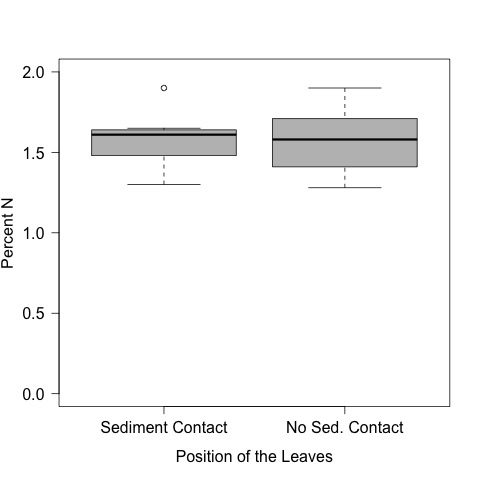
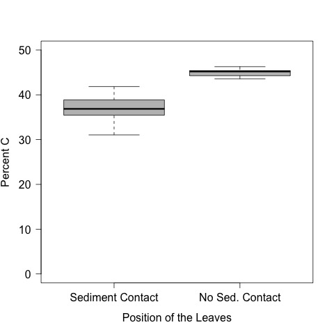
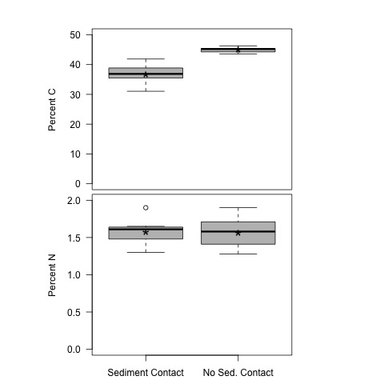
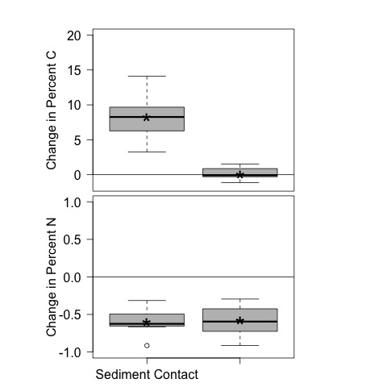

# Analysis of the CN of the leaves in the sediment priming experiment.

## Metadata

* file created 24 May 2017

* Modified: 

  * 22 Feb 2018 - KF - added test of the change in percent C and N
  
  
### Description

These analyses are to evaluate the CN of the leaves in the sediment priming experiment. Details on the experimental set-up and execution can be found: [https://github.com/KennyPeanuts/sediment_priming/blob/master/lab_notebook/lab_notes/Notes_on_set_up.md](https://github.com/KennyPeanuts/sediment_priming/blob/master/lab_notebook/lab_notes/Notes_on_set_up.md) & [https://github.com/KennyPeanuts/sediment_priming/blob/master/lab_notebook/lab_notes/Notes_on_breakdown.md](https://github.com/KennyPeanuts/sediment_priming/blob/master/lab_notebook/lab_notes/Notes_on_breakdown.md)

## Analysis

### Import data

    leaf <- read.table("./data/leaf_disc_CN.csv", header = T, sep = ",")

#### Add factors to the data.frame

    pos <- c(rep("top", 10), rep("sed", 10))
    rep <- rep(1:10, 2)

    leaf <- data.frame(pos, rep, leaf)

## Data Summaries

### CN

     tapply(leaf$CN, leaf$pos, summary)
     tapply(leaf$CN, leaf$pos, sd)

~~~~
$sed
   Min. 1st Qu.  Median    Mean 3rd Qu.    Max.  SD
  25.69   26.18   27.02   27.27   27.92   29.52  1.400546

$top
   Min. 1st Qu.  Median    Mean 3rd Qu.    Max.  SD 
  26.99   31.14   33.62   34.06   35.90   41.52  4.726822 
~~~~

### Percent N
 

     tapply(leaf$percN, leaf$pos, summary)
     tapply(leaf$percN, leaf$pos, sd)

~~~~
$sed
   Min. 1st Qu.  Median    Mean 3rd Qu.    Max.  SD
  1.300   1.495   1.610   1.582   1.640   1.900  0.1580998

$top
   Min. 1st Qu.  Median    Mean 3rd Qu.    Max.  SD
  1.280   1.430   1.580   1.566   1.698   1.900  0.2003441
~~~~

### Percent C

     tapply(leaf$percC, leaf$pos, summary)
     tapply(leaf$percC, leaf$pos, sd)

~~~~
$sed
   Min. 1st Qu.  Median    Mean 3rd Qu.    Max.  SD
  31.04   35.67   36.86   36.90   38.60   41.86  3.060007

$top
   Min. 1st Qu.  Median    Mean 3rd Qu.    Max.  SD
  43.59   44.45   45.21   45.02   45.40   46.28  0.847074
~~~~
 
## Analysis of the Effect of Position on CN

    par(las = 1)
    plot(CN ~ pos, data = leaf, ylim = c(0, 50), ylab = "C:N", xlab = "Leaf Position", col = "lightsalmon", axes = F)
    axis(2)
    axis(1, c("Sediment Contact", "No Sediment Contact"), at = c(1, 2))
    box()
    dev.copy(jpeg, "./output/plots/CN_by_position.jpg")
    dev.off()

### T-test

    t.test(CN ~ pos, data = leaf)

~~~~
 Welch Two Sample t-test

data:  CN by pos
t = -4.3588, df = 10.568, p-value = 0.00125
alternative hypothesis: true difference in means is not equal to 0
95 percent confidence interval:
 -10.243778  -3.346799
sample estimates:
mean in group sed mean in group top 
         27.26926          34.06455 
~~~~

### ANOVA

    anova(lm(CN ~ pos, data = leaf))

~~~~
Analysis of Variance Table

Response: CN
          Df Sum Sq Mean Sq F value    Pr(>F)    
pos        1 230.88 230.880  18.999 0.0003785 ***
Residuals 18 218.74  12.152                      
~~~~
 
## Analysis of the Effect of Position on Percent N

    par(las = 1, lwd = 1)
    plot(percN ~ pos, data = leaf, ylim = c(0, 2), ylab = "Percent N", xlab = " ", col = "gray", axes = F)
    axis(2, cex.lab = 1.5)
    axis(1, c("Sediment Contact", "No Sed. Contact"), at = c(1, 2), cex.lab = 1.5)
    box()
    dev.copy(jpeg, "./output/plots/percN_by_position.jpg")
    dev.off()

### T test

    t.test(percN ~ pos, data = leaf)

~~~~
 Welch Two Sample t-test

data:  percN by pos
t = 0.1983, df = 17.077, p-value = 0.8452
alternative hypothesis: true difference in means is not equal to 0
95 percent confidence interval:
 -0.1542146  0.1862146
sample estimates:
mean in group sed mean in group top 
            1.582             1.566 
            
~~~~

### ANOVA

    anova(lm(percN ~ pos, data = leaf))

~~~~
Analysis of Variance Table

Response: percN
          Df  Sum Sq  Mean Sq F value Pr(>F)
pos        1 0.00128 0.001280  0.0393 0.8451
Residuals 18 0.58620 0.032567    
~~~~

## Analysis of the Effect of Position on Percent C

    par(las = 1)
    plot(percC ~ pos, data = leaf, ylim = c(0, 50), ylab = "Percent C", xlab = " ", col = "gray", axes = F)
    axis(2)
    axis(1, c("Sediment Contact", "No Sed. Contact"), at = c(1, 2))
    box()
    dev.copy(jpeg, "./output/plots/percC_by_position.jpg")
    dev.off()

### T test

     t.test(percC ~ pos, data = leaf)

~~~~
 Welch Two Sample t-test

data:  percC by pos
t = -8.0902, df = 10.371, p-value = 8.509e-06
alternative hypothesis: true difference in means is not equal to 0
95 percent confidence interval:
 -10.349356  -5.896644
sample estimates:
mean in group sed mean in group top 
           36.900            45.023 
~~~~

### ANOVA

     anova(lm(percC ~ pos, data = leaf))

~~~~
Analysis of Variance Table

Response: percC
          Df Sum Sq Mean Sq F value    Pr(>F)    
pos        1 329.92  329.92  65.452 2.088e-07 ***
Residuals 18  90.73    5.04  
~~~~
 
# Two Row Plot for Manuscript

    par(las = 1, mfcol = c(2, 1), mar = c(0.2, 8, 2.5, 8))
    plot(percC ~ pos, data = leaf, ylim = c(0, 50), ylab = "Percent C", xlab = " ", col = "gray", axes = F)
    text(1, mean(leaf$percC[leaf$pos == "sed"]), "*", cex = 2)
    text(2, mean(leaf$percC[leaf$pos == "top"]), "*", cex = 2)
    axis(2)
    box()
    par(mar = c(2.5, 8, 0.2, 8))
    plot(percN ~ pos, data = leaf, ylim = c(0, 2), ylab = "Percent N", xlab = " ", col = "gray", axes = F)
    text(1, mean(leaf$percN[leaf$pos == "sed"]), "*", cex = 2)
    text(2, mean(leaf$percN[leaf$pos == "top"]), "*", cex = 2)
    axis(2, cex.lab = 1.5)
    axis(1, c("Sediment Contact", "No Sed. Contact"), at = c(1, 2), cex.lab = 1.5)
    box()
    dev.copy(jpeg, "./output/plots/percC_and_N_by_position.jpg")
    dev.off()

# Calculation of the Change in Percent C and N

## Initial Percent C and N

The initial percent C and N comes from the analyses from the leached litter experiment.  The details can be found in the mass loss analysis script [https://github.com/KennyPeanuts/sediment_priming/blob/master/lab_notebook/analysis/mass_loss_analysis.md#determine-the-average-initial-percent-c-and-percent-n](https://github.com/KennyPeanuts/sediment_priming/blob/master/lab_notebook/analysis/mass_loss_analysis.md#determine-the-average-initial-percent-c-and-percent-n)
 
    mean_initial_percC <- 45.13
    mean_initial_percN <- 0.9850

## Calculate the Change in Percent C
 
    delta_percC <- mean_initial_percC - leaf$percC

### Summary of Change in Percent C
 
    tapply(delta_percC, leaf$pos, summary)
    tapply(delta_percC, leaf$pos, sd)

~~~~
# The change in percent C of the leaves following the incubation 
  
$sed
   Min. 1st Qu.  Median    Mean 3rd Qu.    Max.  SD
  3.270   6.533   8.265   8.230   9.463  14.090  3.060007 

$top
   Min. 1st Qu.  Median    Mean 3rd Qu.    Max. SD
-1.1500 -0.2675 -0.0800  0.1070  0.6800  1.5400 0.847074 
 
~~~~

### Test for the change in Percent C
  
    t.test(delta_percC ~ pos, data = leaf)

~~~~
# Results of the the t - test of the difference in change in percent C with position
  

 Welch Two Sample t-test

data:  delta_percC by pos
t = 8.0902, df = 10.371, p-value = 8.509e-06
alternative hypothesis: true difference in means is not equal to 0
95 percent confidence interval:
  5.896644 10.349356
sample estimates:
mean in group sed mean in group top 
            8.230             0.107 
 
~~~~
  
Due to some non-homogeneity of variance I also performed a non-parametric test
 
    kruskal.test(delta_percC ~ pos, data = leaf)
 
~~~~
Kruskal-Wallis rank sum test

data:  delta_percC by pos
Kruskal-Wallis chi-squared = 14.2857, df = 1, p-value = 0.0001571

~~~~

## Calculate the Change in Percent N
 
    delta_percN <- mean_initial_percN - leaf$percN

### Summary of Change in Percent N
 
    tapply(delta_percN, leaf$pos, summary)
    tapply(delta_percN, leaf$pos, sd)

~~~~
# The change in percent N of the leaves following the incubation 

$sed
   Min. 1st Qu.  Median    Mean 3rd Qu.    Max. SD
 -0.915  -0.655  -0.625  -0.597  -0.510  -0.315 0.1580998 

$top
   Min. 1st Qu.  Median    Mean 3rd Qu.    Max. SD
-0.9150 -0.7125 -0.5950 -0.5810 -0.4450 -0.2950 0.2003441 

~~~~

### Test for the change in Percent N
  
    t.test(delta_percN ~ pos, data = leaf)

~~~~
# Results of the the t - test of the difference in change in percent C with position
  
 Welch Two Sample t-test

data:  delta_percN by pos
t = -0.1983, df = 17.077, p-value = 0.8452
alternative hypothesis: true difference in means is not equal to 0
95 percent confidence interval:
 -0.1862146  0.1542146
sample estimates:
mean in group sed mean in group top 
           -0.597            -0.581 

~~~~
  
### Plot of Change in Percent C
  
    par(las = 1, mfcol = c(2, 1), mar = c(0.2, 8, 2.5, 8))
    plot(delta_percC ~ pos, data = leaf, ylim = c(-1.5, 20), ylab = "Change in Percent C", xlab = " ", col = "gray", axes = F)
    text(1, mean(delta_percC[leaf$pos == "sed"]), "*", cex = 2)
    text(2, mean(delta_percC[leaf$pos == "top"]), "*", cex = 2)
    axis(2)
    abline(h = 0)
    box()
    par(mar = c(2.5, 8, 0.2, 8))
    plot(delta_percN ~ pos, data = leaf, ylim = c(-1, 1), ylab = "Change in Percent N", xlab = " ", col = "gray", axes = F)
    text(1, mean(delta_percN[leaf$pos == "sed"]), "*", cex = 2)
    text(2, mean(delta_percN[leaf$pos == "top"]), "*", cex = 2)
    axis(2, cex.lab = 1.5)
    axis(1, c("Sediment Contact", "No Sed. Contact"), at = c(1, 2), cex.lab = 1.5)
    abline(h = 0)
    box()
    dev.copy(jpeg, "./output/plots/delta_percC_and_N_by_position.jpg")
    dev.off()

