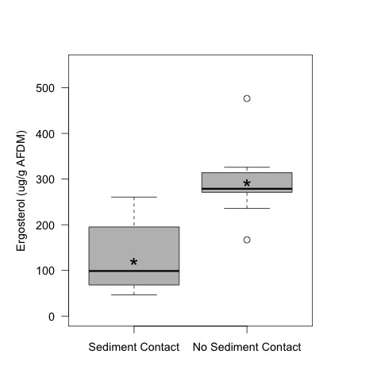
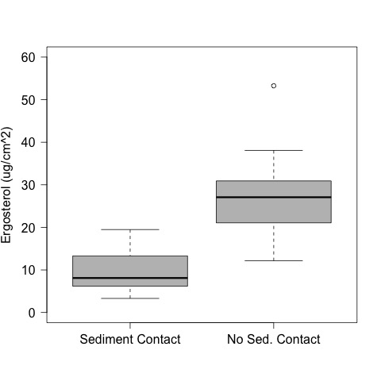
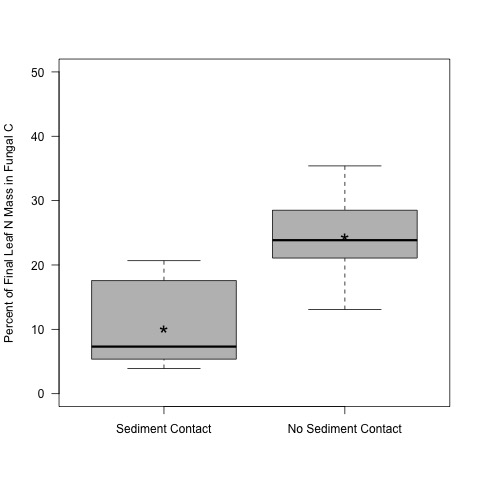

# Analysis of the Ergosterol Content of the leaves in the sediment priming experiment.

## Metadata

* 4 October 2017

* Modified:
 * Added summary stats for ergosterol mass per leaf
 * 1 Nov 2017 - KF - calculated the degree that fungal C mass was from converted leaf C
 * 25 Jan 2018 - KF - tested differences in the percent fungal carbon in the leaves
 * 30 Jan 2018 - KF - recalculated the carbon mass, and percent of fungal C to leaf C based on AFDM rather than leaf dry mass - this better matches with the mass loss analysis
 * 20 June 2018 - KF - added analysis on the amount of N mass in the Fungi at the end of the experiment
 * 21 June 2018 - KF - Calculted the amount of N the leaves should have lost if there was no immobilization (i.e., assuming the CN did not change during decomposition).
 * 22 June 2018 - KF - Did stats on fungal mass, fungal C, and fungal N
 * 17 April 2019 - KF - re-analyzed the significance of ergosterol:w
by location using the difference between the top and the sediment leaves and then tested if mean == 0 with a t-test. Made new plots.
 * 17 April 2019 - KF - recalculated the fungal_mass object as the fungal mass normalized to AFDM of the leaf. Recalculated the data summary and the stats.

### Description

These analyses are to evaluate the Ergosterol Content of the leaves in the sediment priming experiment. Details on the experimental set-up and execution can be found: [https://github.com/KennyPeanuts/sediment_priming/blob/master/lab_notebook/lab_notes/Notes_on_set_up.md](https://github.com/KennyPeanuts/sediment_priming/blob/master/lab_notebook/lab_notes/Notes_on_set_up.md) & [https://github.com/KennyPeanuts/sediment_priming/blob/master/lab_notebook/lab_notes/Notes_on_breakdown.md](https://github.com/KennyPeanuts/sediment_priming/blob/master/lab_notebook/lab_notes/Notes_on_breakdown.md)

## Analysis

### Import data

    erg <- read.table("./data/leaf_ergosterol.csv", header = T, sep = ",")
    init_om <- read.table("data/inital_om.csv", header = T, sep = ",")
    cn <- read.table("data/leaf_disc_CN.csv", header = T, sep = ",")

## Data Summaries

## Ergosterol mass per leaf (ug Ergosterol / leaf disc)

     tapply(erg$Erg_per_leaf, erg$Position, summary)
     tapply(erg$Erg_per_leaf, erg$Position, sd)

~~~~
$Sed
   Min. 1st Qu.  Median    Mean 3rd Qu.    Max.  SD
0.09457 0.18100 0.23190 0.28440 0.37240 0.55790  0.1534152 

$Top
   Min. 1st Qu.  Median    Mean 3rd Qu.    Max.  SD
 0.3473  0.6070  0.7751  0.8014  0.8757  1.5250  0.3267842 

~~~~
 
### Mass Normalized Ergosterol (ug Ergosterol / g AFDM)

     tapply(erg$Erg_mass_norm, erg$Position, summary)
     tapply(erg$Erg_mass_norm, erg$Position, sd)

~~~~
$Sed
   Min. 1st Qu.  Median    Mean 3rd Qu.    Max.   SD
  46.36   70.19   98.74  119.80  171.70  260.70   71.92231

$Top
   Min. 1st Qu.  Median    Mean 3rd Qu.    Max.   SD
  167.0   271.1   278.8   292.7   312.5   476.5   78.89246 
~~~~

### Area Normalized Ergosterol (ug Ergosterol / cm^2)

     tapply(erg$Erg_area_norm, erg$Position, summary)
     tapply(erg$Erg_area_norm, erg$Position, sd)

~~~~
$Sed
   Min. 1st Qu.  Median    Mean 3rd Qu.    Max.   SD
  3.304   6.321   8.100   9.934  13.010  19.490   5.358965 

$Top
   Min. 1st Qu.  Median    Mean 3rd Qu.    Max.   SD
  12.13   21.20   27.08   27.99   30.59   53.26   11.414939 
~~~~
 
 
## Analysis of the Effect of Position on Mass Normalized Ergosterol
### Statistical Tests of the Difference in position == 0

##### Calculate the difference in CN

    diff.Erg_mass_norm <- erg$Erg_mass_norm[erg$Position == "Top"] - erg$Erg_mass_norm[erg$Position == "Sed"]
  
#### Test the difference between the "top" and "sed" samples == 0
  
    t.test(diff.Erg_mass_norm, mu = 0)
  
#==============================   
  
    One Sample t-test
  
    data:  diff.Erg_mass_norm
    t = 5.2436, df = 9, p-value = 0.0005322
    alternative hypothesis: true mean is not equal to 0
    95 percent confidence interval:
      98.30883 247.49180
    sample estimates:
    mean of x 
      172.9003
      
  #============================== 
  
    par(las = 1, cex = 1.2, mar = c(4, 5, 4, 5))
    plot(Erg_mass_norm ~ Position, data = erg, ylim = c(0, 550), ylab = "Ergosterol (ug/g AFDM)", xlab = "", col = 8, axes = F)
    axis(2)
    axis(1, c("Sediment Contact", "No Sediment Contact"), at = c(1, 2))
    text(1, mean(erg$Erg_mass_norm[erg$Position == "Sed"]), "*", cex = 2)
    text(2, mean(erg$Erg_mass_norm[erg$Position == "Top"]), "*", cex = 2)
    box()
    dev.copy(jpeg, "./output/plots/erg_mass_norm_by_position.jpg")
    dev.off()

 
## Analysis of the Effect of Position on Area Normalized Ergosterol

    par(las = 1, lwd = 1)
    plot(Erg_area_norm ~ Position, data = erg, ylim = c(0, 60), ylab = "Ergosterol (ug/cm^2)", xlab = " ", col = "gray", axes = F)
    axis(2, cex.lab = 1.5)
    axis(1, c("Sediment Contact", "No Sed. Contact"), at = c(1, 2), cex.lab = 1.5)
    box()
    dev.copy(jpeg, "./output/plots/Erg_area_norm_by_position.jpg")
    dev.off()

## Calculation of the mass of C in fungal biomass
### Background information
 
There is 1 mg fungal dry mass / 5 ug of ergosterol mass (Su et al. 2015 - citing Gessner and Newell 2002)

Fungi had 43% C and 6.5% N (Findlay et al 2002)

We measured the % C of the leached leaf litter used in the exp as 45 % - this comes from measurements taken from the leached litter CPOM flux experiment.

### Calculation
#### Fungal Mass
Using these estimates we can estimate the fungal dry mass (mg/g AFDM leaf):
 
    fungal_mass <- (1 / 5) * erg$Erg_mass_norm # 1 mg fungal mass / 5 ug ergosterl mass

#### Fungal C and N Mass
The carbon mass (mg/g AFDM leaf) of the fungi on the leaves would be:
 
    fungal_C_mass <- fungal_mass * 0.43
    
The nitrogen mass (mg/g AFDM leaf) of the fungi on the leaves would be:

    fungal_N_mass <- fungal_mass * 0.065

     tapply(fungal_mass, erg$Position, summary)
     tapply(fungal_mass, erg$Position, sd)

~~~~
# Fungal Mass per Leaf (mg/g AFDM leaf)
 
$Sed
   Min. 1st Qu.  Median    Mean 3rd Qu.    Max.  SD
   9.272  14.037  19.747  23.957  34.335  52.142 14.38446
   
$Top
   Min. 1st Qu.  Median    Mean 3rd Qu.    Max.  SD
   33.39   54.22   55.76   58.54   62.49   95.30 15.77849 
   

~~~~
  
## Test of Fungal Biomass by Position
### Statistical Tests of the Difference in position == 0

##### Calculate the difference in Fungal Biomass

    diff.fungal_mass <- fungal_mass[erg$Position == "Top"] - fungal_mass[erg$Position == "Sed"]
  
#### Test the difference between the "top" and "sed" samples == 0
  
    t.test(diff.fungal_mass, mu = 0)
  
#==============================   
  
    One Sample t-test
    
    data:  diff.fungal_mass
    t = 5.2436, df = 9, p-value = 0.0005322
    alternative hypothesis: true mean is not equal to 0
    95 percent confidence interval:
      19.66177 49.49836
    sample estimates:
      mean of x 
    34.58006 
      
#============================== 
      
  
    tapply(fungal_C_mass, erg$Position, summary)
    tapply(fungal_C_mass, erg$Position, sd)

~~~~
# Fungal C Mass (mg C/ g AFDM leaf)
$Sed
    Min.  1st Qu.   Median     Mean    3rd Qu.     Max.     SD
    3.987   6.036   8.491      10.301  14.764     22.421    6.185319
    
$Top
    Min.    1st Qu.  Median    Mean    3rd Qu.    Max.    SD
    14.36   23.32    23.98     25.17   26.87     40.98    6.784752 
~~~~
    

     tapply(fungal_N_mass, erg$Position, summary)
     tapply(fungal_N_mass, erg$Position, sd)

~~~~
# Fungal N Mass (mg C / g AFDM leaf)
       $Sed
     Min.    1st Qu.   Median     Mean   3rd Qu.  Max.      SD
     0.6027  0.9124    1.2836    1.5572  2.2318   3.3892    0.9349901 
     
     $Top
     Min.  1st Qu.   Median  Mean    3rd Qu. Max.      SD
     2.170   3.524   3.624   3.805   4.062   6.194    1.0256020 
     
~~~~

# Percentage of Final Leaf C Mass in the Fungi

To calculate the percent of the final C mass of the leaf that is in fungi, I need the final C mass of the leaves from the mass analysis.

To complete the remaining calculations, you need to run the code in the mass_loss_analysis.R [https://github.com/KennyPeanuts/sediment_priming/blob/master/lab_notebook/analysis/mass_loss_analysis.md#determine-the-c-mass-of-the-leaves](https://github.com/KennyPeanuts/sediment_priming/blob/master/lab_notebook/analysis/mass_loss_analysis.md#determine-the-c-mass-of-the-leaves) so that you get the 'disc_C_mass_final' and the 'disc_N_mass_final' object.
                                                                                              
## Percent of Final C mass of the leaf that is in fungi

The percent of the final leaf C mass that is in fungi:
 
    fungal_mass_leaf <- (1 / 5) * erg$Erg_per_leaf # 1 mg fungal mass / 5 ug ergosterl mass, where fungal mass is in mg/leaf

The carbon mass (mg/leaf) of the fungi on the leaves would be:
 
    fungal_C_mass <- fungal_mass_leaf * 0.43
    
The nitrogen mass (mg/leaf) of the fungi on the leaves would be:

    fungal_N_mass <- fungal_mass_leaf * 0.065

    perc_fungal_C <- (fungal_C_mass / disc_C_mass_final) * 100 

    tapply(perc_fungal_C, erg$Position, summary)
    tapply(perc_fungal_C, erg$Position, sd)

#============================== 
    
# Percent of the final C mass of each leaf disc that is in fungal C

$Sed
   Min. 1st Qu.  Median    Mean 3rd Qu.    Max. SD
  1.026   1.609   2.171   2.890   4.331   6.178 1.886135 

$Top
   Min. 1st Qu.  Median    Mean 3rd Qu.    Max. SD
  3.189   5.141   5.237   5.602   5.987   9.258 1.566612 

#===============================
  
## Test of % Fungal Carbon by Position
### Statistical Tests of the Difference in position == 0

##### Calculate the difference in Percent Fungal C

    diff.perc_fungal_C <- perc_fungal_C[erg$Position == "Top"] - perc_fungal_C[erg$Position == "Sed"]
  
#### Test the difference between the "top" and "sed" samples == 0
  
    t.test(diff.perc_fungal_C, mu = 0)
  
#==============================   
    
    One Sample t-test
    
    data:  diff.perc_fungal_C
    t = 3.5535, df = 9, p-value = 0.006182
    alternative hypothesis: true mean is not equal to 0
    95 percent confidence interval:
      0.9857556 4.4393615
    sample estimates:
      mean of x 
    2.712559 
      
#============================== 
    
    par(las = 1)
    plot(perc_fungal_C ~ erg$Position, ylim = c(0, 10), ylab = "Percent of Final Leaf C Mass in Fungal C", xlab = "", col = 8, axes = F)
    axis(2)
    axis(1, c("Sediment Contact", "No Sediment Contact"), at = c(1, 2))
    text(1, mean(perc_fungal_C[erg$Position == "Sed"]), "*", cex = 2)
    text(2, mean(perc_fungal_C[erg$Position == "Top"]), "*", cex = 2)
    box()
    dev.copy(jpeg, "./output/plots/percent_fungal_c_mass.jpg")
    dev.off()

Figure: Percent of the the final leaf C mass in fungal C mass

## Percent of the final leaf N mass that is in Fungi

The percent of the final leaf N mass that is in fungi:
 
    perc_fungal_N <- (fungal_N_mass / disc_N_mass_final) * 100 

    tapply(perc_fungal_N, erg$Position, summary)
    tapply(perc_fungal_N, erg$Position, sd)
    
#===============================
    
# Percent of the final C mass of each leaf disc that is in fungal C

    $Sed
    Min. 1st Qu.  Median    Mean 3rd Qu.    Max.   SD
    3.913   5.539   7.316  10.117  15.382  20.666  6.502462 
    
    $Top
    Min. 1st Qu.  Median    Mean 3rd Qu.    Max.   SD
    13.08   21.53   23.85   24.45   27.68   35.40  6.024858 
    
#===============================

## Test of % Fungal Carbon by Position
### Statistical Tests of the Difference in position == 0

##### Calculate the difference in Percent Fungal N

    diff.perc_fungal_N <- perc_fungal_N[erg$Position == "Top"] - perc_fungal_N[erg$Position == "Sed"]
  
#### Test the difference between the "top" and "sed" samples == 0
  
    t.test(diff.perc_fungal_N, mu = 0)
  
#==============================   
    
    One Sample t-test
    
    data:  diff.perc_fungal_N
    t = 5.1836, df = 9, p-value = 0.0005766
    alternative hypothesis: true mean is not equal to 0
    95 percent confidence interval:
      8.078293 20.588833
    sample estimates:
      mean of x 
    14.33356 
      
#============================== 
    
 
    par(las = 1)
    plot(perc_fungal_N ~ erg$Position, ylim = c(0, 50), ylab = "Percent of Final Leaf N Mass in Fungal C", xlab = "", col = 8, axes = F)
    axis(2)
    axis(1, c("Sediment Contact", "No Sediment Contact"), at = c(1, 2))
    text(1, mean(perc_fungal_N[erg$Position == "Sed"]), "*", cex = 2)
    text(2, mean(perc_fungal_N[erg$Position == "Top"]), "*", cex = 2)
    box()
    dev.copy(jpeg, "./output/plots/percent_fungal_N_mass.jpg")
    dev.off()

Figure: Percent of the the final leaf N mass in fungal N mass

## Calculation of the amount of N in the Fungi relative to the amount required to lower the C:N 

The results show that the mass of C goes down in the leaves during the incubation but that the mass of N does not go down. This suggests that the microbial community is immobilizing the N that is liberated during decomposition. 

I calculated whether the mass of N contained in the fungal biomass at the end of the experiment would be sufficient to account for the retained N mass.

### Calculate the mass-based C:N

    CN_mass_init <- mean(disc_C_mass_init) / mean(disc_N_mass_init)
    
Mean mass-based CN of a leaf disc at the beginning of the experiment
    [1] 45.82234

### Calculate the N mass expected if there was no immobilization of N
#### Sediment Treatment

    expected_N_mass_final_SED <- (disc_C_mass_final_SED / CN_mass_init) * 1000 # convert to mg
    
    summary(expected_N_mass_final_SED)
    sd(expected_N_mass_final_SED)
    
~~~~
# The mass of N expected in the leaves based on the CN assuming that no N was immobilized (mg) 
#### Sediment Treatment
      Min. 1st Qu.  Median    Mean 3rd Qu.    Max.  SD
    0.01438 0.01704 0.02005 0.01961 0.02114 0.02693 0.003489293
    
~~~~
  
    
#### No-Sediment Treatment

    expected_N_mass_final_TOP <- (disc_C_mass_final_TOP / CN_mass_init) * 1000 # convert to mg
    summary(expected_N_mass_final_TOP)
    sd(expected_N_mass_final_TOP)
    
~~~~
# The mass of N expected in the leaves based on the CN assuming that no N was immobilized
## (mg)
## No-Sediment Treatmen
      Min. 1st Qu.  Median    Mean 3rd Qu.    Max.  SD
    0.01939 0.02291 0.02503 0.02625 0.03035 0.03398 0.005023328
~~~~
      
### Calculate the amount of N mass lost from the leaves if we assume that N loss was proportional to initial stoichiometry

    expected_delta_N_mass_SED <- mean(disc_N_mass_init) - mean(expected_N_mass_final_SED)
    expected_delta_N_mass_TOP <- mean(disc_N_mass_init) - mean(expected_N_mass_final_TOP)

~~~~
# The estimated mass of N that would have been lost from a single leaf disc if the microbial community had not immobilized released DIN (mg)
      
      SED:
      0.01527134
      TOP
      0.008627398
~~~~
        
## Comparison of the N mass expected to be lost from the leaves w/o immobilization and the amount of N mass in the Fungal biomass
        
The difference in the mass of N expected to be lost per leaf to mineralization and the mass of fungi in the leaf is (mg):

### Sediment Treatment       
    expected_delta_N_mass_SED - mean(fungal_N_mass[erg$Position == "Sed"])
### No-Sediment Treatment
    expected_delta_N_mass_TOP - mean(fungal_N_mass[erg$Position == "Top"])

~~~~  
# The difference in the mass of N expected to be lost per leaf to mineralization and the mass of fungi in the leaf is (mg)

SED:
      0.01157428
    
TOP:
      -0.001791039
~~~~

## Calculation of the percent of expected N mass loss that is accounted for by fungal N mass
  
### Sediment Treatment       
    mean(fungal_N_mass[erg$Position == "Sed"]) / expected_delta_N_mass_SED 
### No-Sediment Treatment
    mean(fungal_N_mass[erg$Position == "Top"]) / expected_delta_N_mass_TOP 
    
~~~~
# The proportion of the expected lost nitrogen from leaf biomass that is found in the fungal N mass
      
### Sediment
    0.2420914
### No-Sediment
    1.207599
~~~~
      
These results show that the fungal N can account for a much greater proportion of the mineralized N in the no-sediment treatment than in the sediment treatment, despite the fact that the amount of N in both treatments is essentially the same at the end of the incubation.
    
~~~~    
##################################################    
This is the code that retains the N mass loss in the calculations that I deemed not needed:
      
    The mass loss analysis shows that the leaves did lose some N mass during the experiment so I correct the intial N mass for the observed N mass loss
    
    expected_delta_N_mass_SED <- (mean(disc_N_mass_init) - mean(delta_N_mass[leaf.final$Position == "Sed"])) - mean(expected_N_mass_final_SED)
    expected_delta_N_mass_TOP <- (mean(disc_N_mass_init) - mean(delta_N_mass[leaf.final$Position == "Top"])) - mean(expected_N_mass_final_TOP)

# The estimated mass of N that would have been lost from a single leaf disc if the microbial community had not immobilized released DIN (mg)
      
SED:
      0.018876
TOP
      0.01630365
~~~~