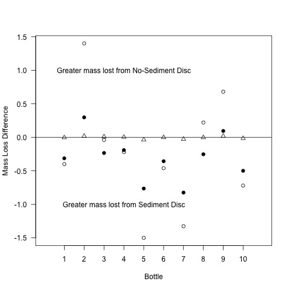

# Analysis of the mass loss of the leaves in the sediment priming experiment.

## Metadata

* file created 29 June 2016 - KF

* Modified:
    * 30 Jan 2018 - KF - summarized the leaf disc mass
    * 2 Feb 2018 - KF - consolodated all of the mass loss analysis here - including AFDM, C and N
    * 15 Feb 2018 - KF - added summary data for initial OM mass
    * 15 Feb 2018 - KF - corrected calculations of C mass and N mass based on the actual values from the data, rather than calculated from % C and N

### Description

These analyses are to evaluate the change in mass of the leaves in the sediment priming experiment. Including the changes in AFDM, C mass, and N mass.

Details on the experimental set-up and execution can be found: [https://github.com/KennyPeanuts/sediment_priming/blob/master/lab_notebook/lab_notes/Notes_on_set_up.md](https://github.com/KennyPeanuts/sediment_priming/blob/master/lab_notebook/lab_notes/Notes_on_set_up.md) & [https://github.com/KennyPeanuts/sediment_priming/blob/master/lab_notebook/lab_notes/Notes_on_breakdown.md](https://github.com/KennyPeanuts/sediment_priming/blob/master/lab_notebook/lab_notes/Notes_on_breakdown.md)

## Analysis

### Import data

    leaf.initial <- read.table("./data/inital_om.csv", header = T, sep = ",")
    leaf.final <- read.table("./data/final_AFDM.csv", header = T, sep = ",")
    cn <- read.table("data/leaf_disc_CN.csv", header = T, sep = ",")
    init_om <- read.table("data/inital_om.csv", header = T, sep = ",")

### Determine Average inital leaf mass

The initial leaf mass came from 9 replicate samples of 10 leaf discs

    init.leaf.mass <- leaf.initial$om.mass[leaf.initial$sample == "leaf"]
    sing.init.leaf.mass <- init.leaf.mass / leaf.initial$leaf.num[leaf.initial$sample == "leaf"]
    mean.init.mass <- mean(sing.init.leaf.mass)
    summary(sing.init.leaf.mass * 1000) # converted to mg
    sd(sing.init.leaf.mass * 1000) # converted to mg
~~~~
# summary of AFDM of a single leaf prior to the beginning the exp (mg)
  
Min. 1st Qu.  Median    Mean 3rd Qu.    Max.     SD 
  2.850   3.330   3.550   3.541   3.680   4.220  0.4188808

~~~~

### Determine the Average Initial percent C and percent N

These data come from the samples collected during the leached litter experiment.  Details about the sample collection can be found at [https://github.com/KennyPeanuts/CPOM_Flux/blob/master/lab_notebook/lab_notes/leached_litter_CN_notes.md](https://github.com/KennyPeanuts/CPOM_Flux/blob/master/lab_notebook/lab_notes/leached_litter_CN_notes.md).  

Briefly, each of the initial samples contained 20, 10 mm leaf discs that were cut from tulip poplar litter that had been leached in DI water for 72 h. These leaves were then processed and run for CN by the Waters lab in the same way as the experimental leaves were.

#### Create data.frame from the leached litter CN 

    rep <- c("A", "B") 
    percC <- c(45.8, 44.47)
    percN <- c(0.94, 1.03)
    CN <- c(56.47032605, 50.39153614)

    initial_cn <- data.frame(rep, percC, percN, CN)

##### Summary of Initial CN data

    summary(initial_cn)
    sd(initial_cn$percC)
    sd(initial_cn$percN)
    sd(initial_cn$CN)

~~~~

rep       percC           percN              CN       
 A:1   Min.   :44.47   Min.   :0.9400   Min.   :50.39  
 B:1   1st Qu.:44.80   1st Qu.:0.9625   1st Qu.:51.91  
       Median :45.13   Median :0.9850   Median :53.43  
       Mean   :45.13   Mean   :0.9850   Mean   :53.43  
       3rd Qu.:45.47   3rd Qu.:1.0075   3rd Qu.:54.95  
       Max.   :45.80   Max.   :1.0300   Max.   :56.47  
       SD: 0.940452    SD: 0.06363961   SD: 4.298354

~~~~
### Determine Average Final AFDM
  
    final.DM <- leaf.final$CrucLeafDM - leaf.final$CrucMass
    final.AM <- leaf.final$CrucAM - leaf.final$CrucMass
    final.AFDM <- final.DM - final.AM

Since there were different numbers of leaves in the crucibles `final.AFDM` is the mass of the total leaves in the crucible

    final.leaf.AFDM <- final.AFDM / leaf.final$LeafNum

### Summarize final leaf mass

    tapply(final.leaf.AFDM * 1000, leaf.final$Position, summary)
    tapply(final.leaf.AFDM * 1000, leaf.final$Position, sd)

~~~~
# Summary of the average mass of a single leaf disc at the end of the exp, by position (mg)
 
$Sed
   Min. 1st Qu.  Median    Mean 3rd Qu.    Max.  SD
  1.940   2.155   2.490   2.440   2.515   3.480  0.4320494 

$Top
   Min. 1st Qu.  Median    Mean 3rd Qu.    Max.  SD
  1.920   2.315   2.580   2.677   3.125   3.540  0.5362904 

~~~~

###  Determine Mass Lost

    AFDM.loss <- mean.init.mass - final.leaf.AFDM

    tapply(AFDM.loss * 1000, leaf.final$Position, summary) 
    tapply(AFDM.loss * 1000, leaf.final$Position, sd)
 
~~~~
AFDM Loss from each postion (mg)

$Sed
   Min. 1st Qu.  Median    Mean 3rd Qu.    Max.  SD
0.06111 1.02600 1.05100 1.10100 1.38600 1.60100  0.4320494

$Top
    Min.  1st Qu.   Median     Mean  3rd Qu.     Max.  SD
0.001111 0.416100 0.961100 0.864400 1.226000 1.621000  0.5362904
~~~~
 
### Compare mass loss by position

    par(las = 1)
    plot(AFDM.loss * 1000 ~ Position, data = leaf.final, ylim = c(0, 2), xlim = c(.50, 2.5), axes = F, xlab = " ", ylab = "Mass Loss (mg AFDM)", col = "gray")
    text(1, mean(AFDM.loss[leaf.final$Position == "Sed"] * 1000), "*", cex = 2)
    text(2, mean(AFDM.loss[leaf.final$Position == "Top"] * 1000), "*", cex = 2)
    axis(2)
    axis(1, c("Sediment Contact", "No Sed. Contact"), at = c(1, 2))
    box()
    dev.copy(jpeg, "./output/plots/mass_loss.jpg")
    dev.off()

Mass lost from leaves in the sediments or water column

#### Statistical Analysis
##### t-test

     t.test(AFDM.loss ~ Position, data = leaf.final)
     
~~~~

 Welch Two Sample t-test

data:  AFDM.loss by Position
t = 1.0867, df = 17.22, p-value = 0.2921
alternative hypothesis: true difference in means is not equal to 0
95 percent confidence interval:
 -0.0002223588  0.0006956921
sample estimates:
mean in group Sed mean in group Top 
     0.0011011111      0.0008644444 

~~~~

Two-way ANOVA including the effect of the bottles

    anova(lm(AFDM.loss ~ Position * Bottle, data = leaf.final))

~~~~

  Analysis of Variance Table

Response: AFDM.loss
Df     Sum Sq    Mean Sq F value Pr(>F)
Position         1 2.8010e-07 2.8006e-07  1.0915 0.3117
Bottle           1 4.3200e-08 4.3205e-08  0.1684 0.6870
Position:Bottle  1 1.2000e-07 1.2002e-07  0.4678 0.5038
Residuals       16 4.1052e-06 2.5658e-07 

~~~~
  
##### Determine the difference between the loss in the water and sed leaves
  
    loss.diff <- AFDM.loss[leaf.final$Position == "Sed"] - AFDM.loss[leaf.final$Position == "Top"]

    par(las = 1)
    plot(loss.diff * 1000 ~ leaf.final$Bottle[leaf.final$Position == "Top"], xlab = "Bottle", ylab = "Sediment Mass Loss - Water Col. Mass Loss (mg AFDM)")
    abline(h = 0)
    dev.copy(jpeg, "./output/plots/mass_loss_diff.jpg")
    dev.off()

Sediment Mass Loss - Water Column Mass Loss

##### Determine the 95% CI of the difference in mass loss

    t.test(loss.diff)

~~~~
One Sample t-test

data:  loss.diff
t = 0.8572, df = 9, p-value = 0.4136
alternative hypothesis: true mean is not equal to 0
95 percent confidence interval:
 -0.0003879115  0.0008612448
sample estimates:
   mean of x 
0.0002366667 
~~~~

### Add Position to the CN data
 
To complete this calculation, I need a treatment level variable for the cn data.frame

     cn.position <- c(rep("top", 10), rep("sed", 10))

Each sample for CN contained 3 leaf discs so I now calculate mass of C for a single leaf based on the number of leaf discs in the samples.  

    massC_single_disc <- cn$massC / 3

    tapply(massC_single_disc, cn.position, summary) 
    tapply(massC_single_disc, cn.position, sd)

~~~~
# Mass of C in each leaf disc after incubation (mg)
 
$sed
   Min. 1st Qu.  Median    Mean 3rd Qu.    Max. SD 
 0.8615  0.9899  1.0230  1.0240  1.0710  1.1620 0.08492448 

$top
   Min. 1st Qu.  Median    Mean 3rd Qu.    Max. SD
  1.210   1.234   1.255   1.250   1.260   1.284 0.02350887 

~~~~
 
#### Leaf Disc C Mass Initial
 
The C mass of the leaf discs prior to the incbation is estimated by the % C of the leaves before the incubation and the masses of the leaf discs before the incubation.

The initial leaf disc masses are calculated by dividing the total sample AFDM mass by the number of leaf discs in the sample and then converting to mg

##### Initial C mass of a single leaf 

    disc_mass_init <- (init_om$om.mass[init_om$sample == "leaf"] / init_om$leaf.num[init_om$sample == "leaf"]) * 1000 # converted to mg 

    disc_C_mass_init <- disc_mass_init * 0.45 # the % C of the leaves prior to incubation rounded up from the mean % C of the intial leaf % C in the leached litter exp. 

    summary(disc_C_mass_init)
    sd(disc_C_mass_init)

~~~~
# Estimated carbon mass of a single leaf disc prior to incubation (mg)
 
Min. 1st Qu.  Median    Mean 3rd Qu.    Max.     SD
  1.283   1.499   1.597   1.594   1.656   1.899  0.1884964
~~~~
    disc_mass_init <- (init_om$om.mass[init_om$sample == "leaf"] / init_om$leaf.num[init_om$sample == "leaf"]) * 1000 # converted to mg 

    init_propC <- mean(initial_cn$percC) / 100 # calculates the mean initial proportion of C
by converting the mean percent C into a proportion

    disc_C_mass_init <- disc_mass_init * init_propC

    summary(disc_C_mass_init)
    sd(disc_C_mass_init)

~~~~
# Estimated carbon mass of a single leaf disc prior to incubation (mg)

 Min. 1st Qu.  Median    Mean 3rd Qu.    Max.    SD
  1.286   1.503   1.602   1.598   1.661   1.905  0.1890618
 
~~~~
 
#### Change in C Mass During Incubation
 
    delta_C_mass <- mean(disc_C_mass_init) - massC_single_disc

    tapply(delta_C_mass, leaf.final$Position, summary)
    tapply(delta_C_mass, leaf.final$Position, sd)

~~~~
# Change in the mass of C in a leaf disc (mg)
 
$Sed
   Min. 1st Qu.  Median    Mean 3rd Qu.    Max.  SD 
 0.4365  0.5271  0.5752  0.5742  0.6084  0.7368  0.08492448 

$Top
   Min. 1st Qu.  Median    Mean 3rd Qu.    Max. SD
 0.3139  0.3384  0.3436  0.3488  0.3647  0.3885 0.02350887 

~~~~~
 
 
##### Test of Change in C mass of a leaf Disc during incbation by position

    t.test(delta_C_mass ~ leaf.final$Position)
 
~~~~
Welch Two Sample t-test

data:  delta_C_mass by leaf.final$Position
t = 8.0902, df = 10.371, p-value = 8.509e-06
alternative hypothesis: true difference in means is not equal to 0
95 percent confidence interval:
 0.1636497 0.2872260
sample estimates:
mean in group Sed mean in group Top 
        0.5741936         0.3487558

~~~~

 
    par(las = 1)
    plot(delta_C_mass ~ leaf.final$Position, ylim = c(0, 1), ylab = "C Mass Loss (mg)", xlab = "Position", col = "grey")
    text(1, mean(delta_C_mass[leaf.final$Position == "Sed"]), "*", cex = 2)
    text(2, mean(delta_C_mass[leaf.final$Position == "Top"]), "*", cex = 2)
    dev.copy(jpeg, "./output/plots/delta_c_mass.jpg")
    dev.off()

Figure: Change in final leaf C mass

Create an AFDM value in mg
    AFDM.mg <- leaf.final$AFDM * 1000
    
    par(las = 1)
    plot(massC_single_disc ~ AFDM.mg , data = leaf.final, subset = Position == "Sed", ylim = c(0, 2), xlim = c(0, 4), ylab = "C Mass (mg)", xlab = "AFDM (mg)", pch = 1)
    points(massC_single_disc ~ AFDM.mg , data = leaf.final, subset = Position == "Top", pch = 19)
    legend(0, 2, c("Sediment Contact", "No Sediment Contact"), pch = c(1, 19))
    dev.copy(jpeg, "./output/plots/C_mass_by_AFDM.jpg")
    dev.off()

Figure: C mass plotted against AFDM for the leaf discs

### Determination of the change in N mass in the leaves 

This is done the same way as was done with C above.

    massN_single_disc <- cn$massN / 3

    tapply(massN_single_disc, cn.position, summary) 
    tapply(massN_single_disc, cn.position, sd)

~~~~
# Estimated N mass of a single leaf disc (mg)
 
$sed
   Min. 1st Qu.  Median    Mean 3rd Qu.    Max. SD 
0.03094 0.03558 0.03831 0.03765 0.03903 0.04522 0.003762481 

$top
   Min. 1st Qu.  Median    Mean 3rd Qu.    Max. SD
0.03046 0.03403 0.03760 0.03727 0.04040 0.04522 0.004767817 
~~~~
 
##### Initial N mass of a single leaf 

    disc_N_mass_init <- disc_mass_init * mean(initial_cn$percN / 100)

    summary(disc_N_mass_init)
    sd(disc_N_mass_init)

~~~~
# Initial N mass of a single leaf disc prior to incubation (mg)
 
 Min. 1st Qu.  Median    Mean 3rd Qu.    Max.   SD
0.02807 0.03280 0.03497 0.03488 0.03625 0.04157 0.004125976

~~~~
 
#### Change in N mass following incuabation 
 
    delta_N_mass <- mean(disc_N_mass_init) - massN_single_disc 

    tapply(delta_N_mass, leaf.final$Position, summary)
    tapply(delta_N_mass, leaf.final$Position, sd)

~~~~
# Loss of N mass from a single leaf disc during the incubation (mg)

$Sed
      Min.    1st Qu.     Median       Mean    3rd Qu.       Max. SD  
-0.0103400 -0.0041490 -0.0034350 -0.0027690 -0.0006983  0.0039420 0.003762481 

$Top
      Min.    1st Qu.     Median       Mean    3rd Qu.       Max. SD
-0.0103400 -0.0055170 -0.0027210 -0.0023880  0.0008486  0.0044180 0.004767817 
~~~~

##### Test of N Mass Loss
 
     t.test(delta_N_mass ~ leaf.final$Position)

~~~~
 
Welch Two Sample t-test

data:  delta_N_mass by leaf.final$Position
t = -0.1983, df = 17.077, p-value = 0.8452
alternative hypothesis: true difference in means is not equal to 0
95 percent confidence interval:
 -0.004431561  0.003670021
sample estimates:
mean in group Sed mean in group Top 
     -0.002768705      -0.002387934 
~~~~
 
##### Plot of N Mass Loss 
 
    par(las = 1)
    plot(delta_N_mass ~ leaf.final$Position, ylim = c(-0.02, 0.01), ylab = "N Mass Loss (mg)", xlab = "Position", col = "grey")
    text(1, mean(delta_N_mass[leaf.final$Position == "Sed"]), "*", cex = 2)
    text(2, mean(delta_N_mass[leaf.final$Position == "Top"]), "*", cex = 2)
    dev.copy(jpeg, "./output/plots/delta_n_mass.jpg")
    dev.off()

 