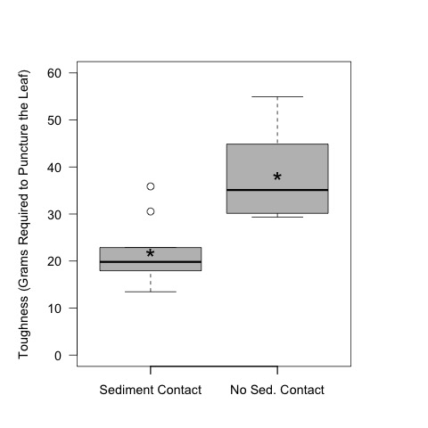

# Analysis of the toughness of the leaves in the sediment priming experiment.

## Metadata

* file created 12 Jan 2016

* Modified:
  * 7 Feb 2018 - KF - added correlation with CN

### Description

These analyses are to evaluate the toughness of the leaves in the sediment priming experiment. Details on the experimental set-up and execution can be found: [https://github.com/KennyPeanuts/sediment_priming/blob/master/lab_notebook/lab_notes/Notes_on_set_up.md](https://github.com/KennyPeanuts/sediment_priming/blob/master/lab_notebook/lab_notes/Notes_on_set_up.md) & [https://github.com/KennyPeanuts/sediment_priming/blob/master/lab_notebook/lab_notes/Notes_on_breakdown.md](https://github.com/KennyPeanuts/sediment_priming/blob/master/lab_notebook/lab_notes/Notes_on_breakdown.md)

## Analysis

### Import data

    tough <- read.table("./data/leaf_toughness.csv", header = T, sep = ",")
    cn <- read.table("./data/leaf_disc_CN.csv", header = T, sep = ",")

## Analysis of the Effect of Position on Toughness

Three replicate leaves were haphazardly selected from each bottle and run on the toughness-meter.  The average mass required to penetrate the leaves was calculated for each bottle.

### Calculation of the average penetration mass for each bottle

    mean.tough.top <- as.numeric(tapply(tough$mass[tough$position == "top"], tough$bottle[tough$position == "top"], mean))

    mean.tough.sed <- as.numeric(tapply(tough$mass[tough$position == "sed"], tough$bottle[tough$position == "sed"], mean))

### Create data.frame with mean toughness values

    bottle <- rep(1:10, 2)
    Position <- c(rep("Top", 10), rep("Sed", 10))
    mean.tough <- c(mean.tough.top, mean.tough.sed)

    mean_tough <- data.frame(Position, bottle, mean.tough)

#### Summary Statistics

    summary(mean.tough.top)
    sd(mean.tough.top)

~~~~
Summary Statistics for the mass (g) required to puncture the leaves off the sediments (top)

 Min.     1st Qu.  Median    Mean    3rd Qu.    Max.     SD
 29.33    30.64    35.10     38.14   44.80      54.96    8.681427

~~~~

    summary(mean.tough.sed)
    sd(mean.tough.sed)

~~~~
Summary Statistics for the mass (g) required to puncture the leaves on the sediments (sed)

 Min.    1st Qu.  Median    Mean    3rd Qu.    Max.    SD 
 13.47   17.98    19.82     21.78   22.70      35.87   6.700327

~~~~

### Analysis of the effect of position on mass (g) required to puncture the leaves
 
    t.test(mean.tough.sed, mean.tough.top)

~~~~

Welch Two Sample t-test

data:  mean.tough.sed and mean.tough.top
t = -4.7175, df = 16.914, p-value = 0.0002013
alternative hypothesis: true difference in means is not equal to 0
95 percent confidence interval:
 -23.679117  -9.040296
sample estimates:
mean of x mean of y 
 21.78453  38.14424 

~~~~
 
### Plots
 
    par(las = 1)
    boxplot(mean.tough.sed, mean.tough.top, ylim = c(0, 60), ylab = "Mean Mass Required to Puncture the Leaf (g)", xlab = " ", col = 8 )
    text(1, mean(mean.tough.sed), "*", cex = 2)
    text(2, mean(mean.tough.top), "*", cex = 2)
    axis(1, c("Sediment Contact", "No Sed. Contact"), at = c(1, 2))
    dev.copy(jpeg, "./output/plots/toughness.jpg")
    dev.off()

Boxplot of the mass (g) required to puncture each leaf with a standard punch.

    par(las = 1)
    plot(mean.tough.sed, ylim = c(0, 60), ylab = "Mean Mass Required to Puncture the Leaf (g)", xlab = "Bottle")
    points(mean.tough.top, pch = 19)
    legend(1, 15, c("Sed. Contact", "No Sed. Contact"), pch = c(1, 19))
    dev.copy(jpeg, "./output/plots/toughness_by_bottle.jpg")
    dev.off()

Plot of the mean mass required to punch the leaves in each bottle.

### Correlation of toughness with perc C
#### Percent C
##### one-way without position 

     tough_by_percC_mod <- lm(mean.tough ~ cn$percC)
     summary(tough_by_percC_mod)

~~~~
# linear regression of toughness by percent C
 
Call:
lm(formula = mean.tough ~ cn$percC)

Residuals:
    Min      1Q  Median      3Q     Max 
-12.563  -5.878  -1.897   6.788  17.859 

Coefficients:
            Estimate Std. Error t value Pr(>|t|)    
(Intercept) -36.9047    17.0757  -2.161 0.044399 *  
cn$percC      1.6325     0.4143   3.941 0.000959 ***

Residual standard error: 8.497 on 18 degrees of freedom
Multiple R-squared:  0.4631, Adjusted R-squared:  0.4333 
F-statistic: 15.53 on 1 and 18 DF,  p-value: 0.0009589

~~~~

##### two-way ANCOVA with percC * Position
 
     tough_by_percC_pos_mod <- lm(mean.tough ~ cn$percC * mean_tough$Position)
     anova(tough_by_percC_pos_mod)

~~~~
# Two-way ANCOVA with percent C * Position
 
Analysis of Variance Table

Response: mean.tough
                             Df  Sum Sq Mean Sq F value    Pr(>F)    
cn$percC                      1 1121.03 1121.03 16.6815 0.0008646 ***
mean_tough$Position           1  222.63  222.63  3.3128 0.0874988 .  
cn$percC:mean_tough$Position  1    1.67    1.67  0.0248 0.8767680    
Residuals                    16 1075.23   67.20       

~~~~

#### Percent N
##### one-way without Position

     tough_by_percN_mod <- lm(mean.tough ~ cn$percN)
     summary(tough_by_percN_mod)

~~~~
# linear regression of toughness by percN  

Call:
lm(formula = mean.tough ~ cn$percN)

Residuals:
     Min       1Q   Median       3Q      Max 
-18.0547  -9.8586  -0.9812   7.6055  18.5262 

Coefficients:
            Estimate Std. Error t value Pr(>|t|)  
(Intercept)    64.57      22.51   2.869   0.0102 *
cn$percN      -21.99      14.21  -1.547   0.1393  

Residual standard error: 10.89 on 18 degrees of freedom
Multiple R-squared:  0.1173, Adjusted R-squared:  0.06831 
F-statistic: 2.393 on 1 and 18 DF,  p-value: 0.1393

~~~~
 
##### two-way ANCOVA with percN * Position
 
     tough_by_percN_pos_mod <- lm(mean.tough ~ cn$percN * mean_tough$Position)
     anova(tough_by_percN_pos_mod)

~~~~
# two-way ANCOVA with percN * Position
 
Analysis of Variance Table

Response: mean.tough
                             Df  Sum Sq Mean Sq F value   Pr(>F)    
cn$percN                      1  284.04  284.04  5.6166 0.030699 *  
mean_tough$Position           1 1284.06 1284.06 25.3908 0.000121 ***
cn$percN:mean_tough$Position  1   43.30   43.30  0.8562 0.368542    
Residuals                    16  809.15   50.57     

~~~~
     plot(cn$percC[mean_tough$Position == "Top"], mean_tough$mean.tough[mean_tough$Position == "Top"], ylim = c(0, 60), xlim = c(0, 60), ylab = "Toughness (g regured to puncture leaf)", xlab = "Percent C or N")
     points(cn$percC[mean_tough$Position == "Sed"], mean_tough$mean.tough[mean_tough$Position == "Sed"], pch = 19)
     points(cn$percN[mean_tough$Position == "Top"], mean_tough$mean.tough[mean_tough$Position == "Top"], pch = 2)
     points(cn$percN[mean_tough$Position == "Sed"], mean_tough$mean.tough[mean_tough$Position == "Sed"], pch = 17)
     #points(cn$CN[mean_tough$Position == "Top"], mean_tough$mean.tough[mean_tough$Position == "Top"], pch = 23)
     #points(cn$CN[mean_tough$Position == "Sed"], mean_tough$mean.tough[mean_tough$Position == "Sed"], pch = 18)
     dev.copy(jpeg, "./output/plots/tough_by_percC_percN.jpg")
     dev.off()

Toughness by percent C (circles) or N (triangles) for leaves in contact with the sediments (open) or not in contact with the sediments (closed).