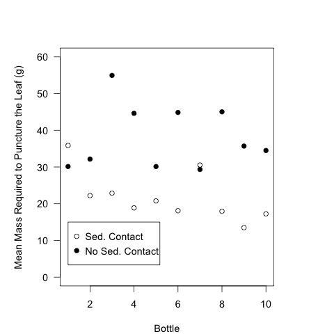

# Analysis of the toughness of the leaves in the sediment priming experiment.

## Metadata

* file created 12 Jan 2016

* Modified: 

### Description

These analyses are to evaluate the toughness of the leaves in the sediment priming experiment. Details on the experimental set-up and execution can be found: [https://github.com/KennyPeanuts/sediment_priming/blob/master/lab_notebook/lab_notes/Notes_on_set_up.md](https://github.com/KennyPeanuts/sediment_priming/blob/master/lab_notebook/lab_notes/Notes_on_set_up.md) & [https://github.com/KennyPeanuts/sediment_priming/blob/master/lab_notebook/lab_notes/Notes_on_breakdown.md](https://github.com/KennyPeanuts/sediment_priming/blob/master/lab_notebook/lab_notes/Notes_on_breakdown.md)

## Analysis

### Import data

    tough <- read.table("./data/leaf_toughness.csv", header = T, sep = ",")

## Analysis of the Effect of Position on Toughness

Three replicate leaves were haphazardly selected from each bottle and run on the toughness-meter.  The average mass required to penetrate the leaves was calculated for each bottle.

### Calculation of the average penetration mass for each bottle

    mean.tough.top <- as.numeric(tapply(tough$mass[tough$position == "top"], tough$bottle[tough$position == "top"], mean))

    mean.tough.sed <- as.numeric(tapply(tough$mass[tough$position == "sed"], tough$bottle[tough$position == "sed"], mean))

#### Summary Statistics

    summary(mean.tough.top)
    sd(mean.tough.top)

~~~~
Summary Statistics for the mass (g) required to puncture the leaves off the sediments (top)

 Min.     1st Qu.  Median    Mean    3rd Qu.    Max.     SD
 29.33    30.64    35.10     38.14   44.80      54.96    8.681427

~~~~

    summary(mean.tough.sed)
    sd(mean.tough.sed)

~~~~
Summary Statistics for the mass (g) required to puncture the leaves on the sediments (sed)

 Min.    1st Qu.  Median    Mean    3rd Qu.    Max.    SD 
 13.47   17.98    19.82     21.78   22.70      35.87   6.700327

~~~~

### Analysis of the effect of position on mass (g) required to puncture the leaves
 
    t.test(mean.tough.sed, mean.tough.top)

~~~~

Welch Two Sample t-test

data:  mean.tough.sed and mean.tough.top
t = -4.7175, df = 16.914, p-value = 0.0002013
alternative hypothesis: true difference in means is not equal to 0
95 percent confidence interval:
 -23.679117  -9.040296
sample estimates:
mean of x mean of y 
 21.78453  38.14424 

~~~~
 
### Plots
 
    par(las = 1)
    boxplot(mean.tough.sed, mean.tough.top, ylim = c(0, 60), ylab = "Mean Mass Required to Puncture the Leaf (g)", xlab = " ", col = 8 )
    text(1, mean(mean.tough.sed), "*", cex = 2)
    text(2, mean(mean.tough.top), "*", cex = 2)
    axis(1, c("Sediment Contact", "No Sed. Contact"), at = c(1, 2))
    dev.copy(jpeg, "./output/plots/toughness.jpg")
    dev.off()

Boxplot of the mass (g) required to puncture each leaf with a standard punch.

    par(las = 1)
    plot(mean.tough.sed, ylim = c(0, 60), ylab = "Mean Mass Required to Puncture the Leaf (g)", xlab = "Bottle")
    points(mean.tough.top, pch = 19)
    legend(1, 15, c("Sed. Contact", "No Sed. Contact"), pch = c(1, 19))
    dev.copy(jpeg, "./output/plots/toughness_by_bottle.jpg")
    dev.off()

Plot of the mean mass required to punch the leaves in each bottle.